# YFEvents Database Schema Analysis Report

Generated: 2025-07-01

## Executive Summary

- **Database**: yakima_finds
- **Total Tables**: 35
- **Database Size**: ~2-3 MB (estimated based on row counts)
- **Storage Engine**: InnoDB (assumed based on foreign key support)
- **Character Set**: utf8mb4
- **Collation**: utf8mb4_unicode_ci

## Table Inventory by Module

### Core YFEvents Tables (8 tables)
- `events` - Main event storage (0 rows)
- `local_shops` - Business directory (0 rows)
- `calendar_sources` - Event scraper configurations (0 rows)
- `event_categories` - Event categorization (8 rows)
- `event_category_relations` - Many-to-many event categories (0 rows)
- `event_images` - Event photo storage (0 rows)
- `shop_categories` - Business categories (12 rows)
- `shop_images` - Business photos (0 rows)
- `shop_owners` - Business owner accounts (0 rows)
- `scraping_logs` - Scraper activity logs (0 rows)
- `calendar_permissions` - Permission management (0 rows)

### YFAuth Module Tables (8 tables, prefix: yfa_)
- `yfa_auth_users` - User accounts (1 row)
- `yfa_auth_roles` - Role definitions (7 rows)
- `yfa_auth_permissions` - Permission definitions (31 rows)
- `yfa_auth_user_roles` - User-role assignments (1 row)
- `yfa_auth_role_permissions` - Role-permission mappings (59 rows)
- `yfa_auth_sessions` - Active sessions (0 rows)
- `yfa_auth_password_resets` - Password reset tokens (0 rows)
- `yfa_auth_activity_log` - User activity tracking (0 rows)

### YFClaim Module Tables (10 tables, prefix: yfc_)
- `yfc_sellers` - Estate sale companies (0 rows)
- `yfc_sales` - Estate sales (0 rows)
- `yfc_items` - Sale items (0 rows)
- `yfc_item_images` - Item photos (0 rows)
- `yfc_buyers` - Buyer accounts (0 rows)
- `yfc_offers` - Purchase offers (0 rows)
- `yfc_offer_history` - Offer status changes (0 rows)
- `yfc_categories` - Item categories (11 rows)
- `yfc_notifications` - System notifications (0 rows)
- `yfc_access_log` - QR code access logs (0 rows)

### YFTheme Module Tables (6 tables)
- `theme_categories` - Variable categories (6 rows)
- `theme_variables` - CSS variable definitions (45 rows)
- `theme_presets` - Theme presets (3 rows)
- `theme_preset_variables` - Preset variable values (135 rows)
- `theme_variable_overrides` - Context-specific overrides (0 rows)
- `theme_history` - Change tracking (0 rows)

## Entity Relationship Diagram

```mermaid
erDiagram
    %% Core Event System
    events ||--o{ event_category_relations : "has categories"
    event_categories ||--o{ event_category_relations : "categorizes"
    events ||--o{ event_images : "has images"
    calendar_sources ||--o{ events : "provides"
    calendar_sources ||--o{ scraping_logs : "generates"
    
    %% Shop System
    local_shops ||--o{ shop_images : "has images"
    shop_categories ||--o{ local_shops : "categorizes"
    shop_categories ||--o{ shop_categories : "has parent"
    shop_owners ||--o{ local_shops : "owns"
    
    %% Auth System
    yfa_auth_users ||--o{ yfa_auth_user_roles : "has roles"
    yfa_auth_roles ||--o{ yfa_auth_user_roles : "assigned to"
    yfa_auth_roles ||--o{ yfa_auth_role_permissions : "has permissions"
    yfa_auth_permissions ||--o{ yfa_auth_role_permissions : "granted to"
    yfa_auth_users ||--o{ yfa_auth_sessions : "has sessions"
    yfa_auth_users ||--o{ yfa_auth_password_resets : "requests reset"
    yfa_auth_users ||--o{ yfa_auth_activity_log : "performs actions"
    yfa_auth_users ||--o{ yfa_auth_user_roles : "assigned by"
    
    %% Theme System
    theme_categories ||--o{ theme_variables : "groups"
    theme_presets ||--o{ theme_preset_variables : "defines"
    theme_variables ||--o{ theme_preset_variables : "has value in"
    theme_variables ||--o{ theme_variable_overrides : "overridden by"
    theme_presets ||--o{ theme_history : "tracked in"
    theme_variables ||--o{ theme_history : "tracked in"
```

## Key Relationships

### Core System
1. **Events ← Calendar Sources**: Events are imported from various sources
2. **Events ↔ Event Categories**: Many-to-many relationship via junction table
3. **Events → Event Images**: One-to-many image storage
4. **Local Shops → Shop Categories**: Hierarchical categorization
5. **Local Shops ← Shop Owners**: Ownership and management

### Authentication System (YFAuth)
1. **Users ↔ Roles**: Many-to-many via user_roles junction
2. **Roles ↔ Permissions**: Many-to-many via role_permissions junction
3. **Users → Sessions**: Active session tracking
4. **Users → Activity Log**: Audit trail

### Estate Sales System (YFClaim)
- Currently no foreign key relationships defined in the database
- Logical relationships exist but are managed at application level

### Theme System
1. **Variables → Categories**: Grouped organization
2. **Presets ↔ Variables**: Many-to-many value storage
3. **Variables → Overrides**: Context-specific customization
4. **All changes → History**: Comprehensive audit trail

## Database Health Check

### ✅ Positive Findings
- All tables have primary keys
- Proper indexing on foreign keys and frequently queried columns
- Consistent naming conventions within modules
- Appropriate use of JSON columns for flexible data
- Timestamp tracking on all major entities

### ⚠️ Areas for Improvement

1. **Missing Foreign Keys in YFClaim Module**
   - No database-enforced relationships between sellers, sales, items, buyers, and offers
   - Referential integrity handled only at application level

2. **Empty Core Tables**
   - Most tables have 0 rows, suggesting either:
     - Fresh installation
     - Data migration pending
     - Development/testing environment

3. **Potential Missing Tables**
   - No geocode_cache table (referenced in CLAUDE.md)
   - No event_submissions table (referenced in CLAUDE.md)
   - No shop_claims table (referenced in CLAUDE.md)
   - No shop_amenities table (referenced in CLAUDE.md)

4. **Module Isolation**
   - No cross-module foreign keys (good for modularity)
   - But may complicate queries requiring cross-module data

## Module Analysis

### Core Module
- **Purpose**: Event calendar and business directory
- **Status**: Schema complete, awaiting data
- **Integration**: Minimal coupling, uses source_id for scraper tracking

### YFAuth Module
- **Purpose**: User authentication and authorization
- **Status**: Fully populated with roles and permissions
- **Integration**: Designed to support all other modules

### YFClaim Module
- **Purpose**: Estate sale claim platform
- **Status**: Schema installed, no data, missing FK constraints
- **Integration**: Operates independently

### YFTheme Module
- **Purpose**: Dynamic theming system
- **Status**: Fully populated with variables and presets
- **Integration**: Standalone CSS variable management

## Schema Evolution Indicators

1. **Migration Scripts Found**:
   - `/database/apply_migrations.php` - Intelligent scraper additions
   - Multiple SQL files suggest incremental development

2. **Schema Files**:
   - Main: `/database/calendar_schema.sql`
   - Modules: Each module has its own schema.sql
   - Improvements: Various enhancement scripts

3. **Version Indicators**:
   - APP_VERSION in .env: 2.0.0
   - Suggests major refactoring from 1.x

## Recommendations

1. **Add Foreign Key Constraints to YFClaim**
   - Enforce referential integrity at database level
   - Prevent orphaned records

2. **Implement Missing Tables**
   - Add geocode_cache for location caching
   - Add event_submissions for community contributions
   - Add shop claims workflow tables

3. **Data Population**
   - Import or scrape initial event data
   - Seed shop directory with local businesses
   - Test all module interactions

4. **Performance Optimization**
   - Add composite indexes for common query patterns
   - Consider partitioning for events table (by date)
   - Implement query result caching

5. **Documentation**
   - Create data dictionary
   - Document business rules enforced by constraints
   - Map application-level relationships